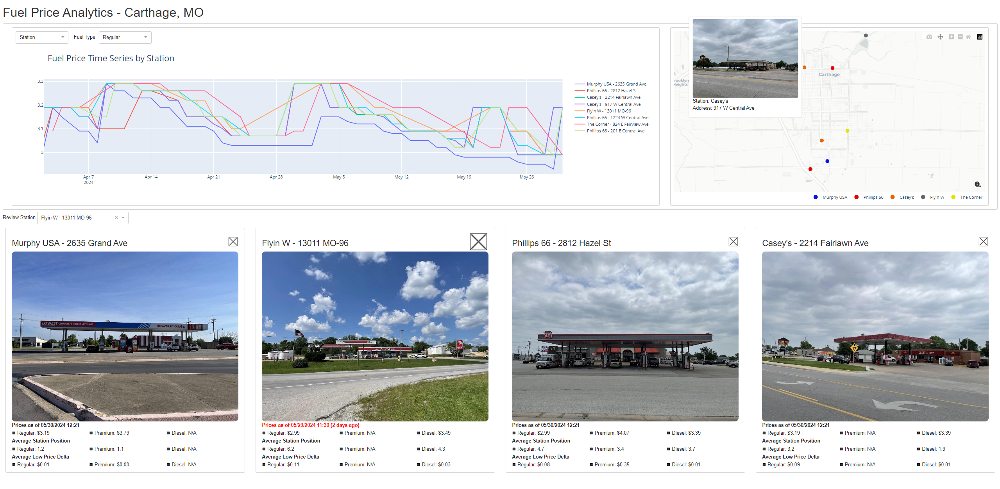

# Fuel Price Analytics
Fluctuating gas prices is something that everyone observes with the usual goal of minimizing the cost of filling your tank.  A potential stumbling block being that multiple gas stations within the same area can have different prices.  Do some stations typically have a lower relative cost than others?

This project reviewed gas prices for local stations in Carthage, MO in an attempt to identify pricing behaviors.  Components of the project are described below.

**Data Extract, Transfer, & Load (ETL)**  
Pricing data was retrieved on a daily schedule from the [GasBuddy](https://www.gasbuddy.com/gasprices/missouri/carthage) website.  This was implemented using a Python script working with the Selenium web driver to automatically scrape data from the web page.  Resulting data was transformed and stored in a local CSV file.  This component of the project can be found within the WebScrape project folder.

**Data Presentation**  
An interactive web dashboard has been created for the consumption of the data using Plotly's Dash framework.  The dashboard contains time series charts, map locating stations, and cards to present metric associated with each station.  This part of the project is located within the Dashboard project folder.

A screenshot of the dashboard can be seen in the figure below.  This screenshot illustrates the following features of the dashboard.

- Time series plot with traces showing the recorded regular fuel price for each station.
- Map showing the location of each station with a tooltip containing an image of the station with its address.
- Individual cards reporting summary metrics for 4 stations.

A short video of the dashboard can be accessed [here](ProjectVisuals/DashboardDemo.mp4).

**Data Observations**  
If we can assume the pricing information from the GasBuddy website is accurate, then the following observations can be drawn from the data.

- The highest price for regular fuel was $3.23 occurring on April 12-14.  The lowest price observed was $2.93 on May 29. 
- Diesel fuel prices remained relatively stable compared with the other two types.
- Murphy USA (2635 Grand Ave) consistently recorded the lowest regular fuel price.
- Variations in regular fuel prices across the set of stations on a given day varied considerably.  The smallest variation was $0.04 while the largest was $0.21.  